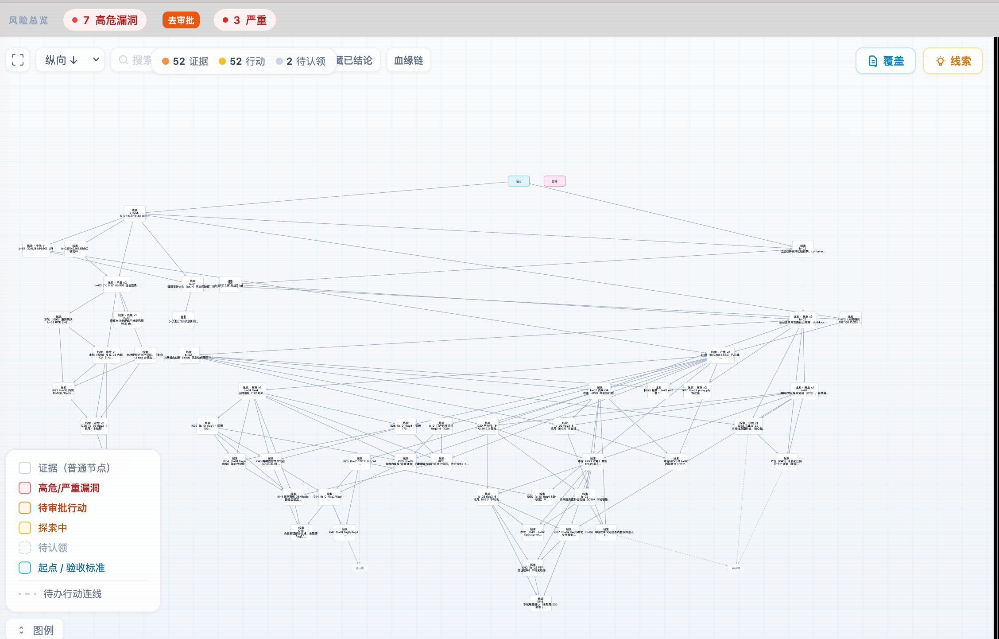
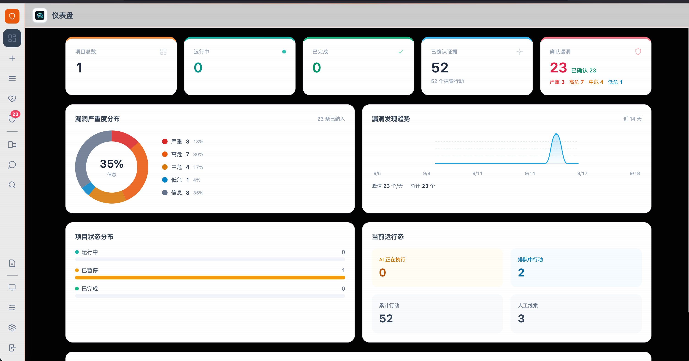
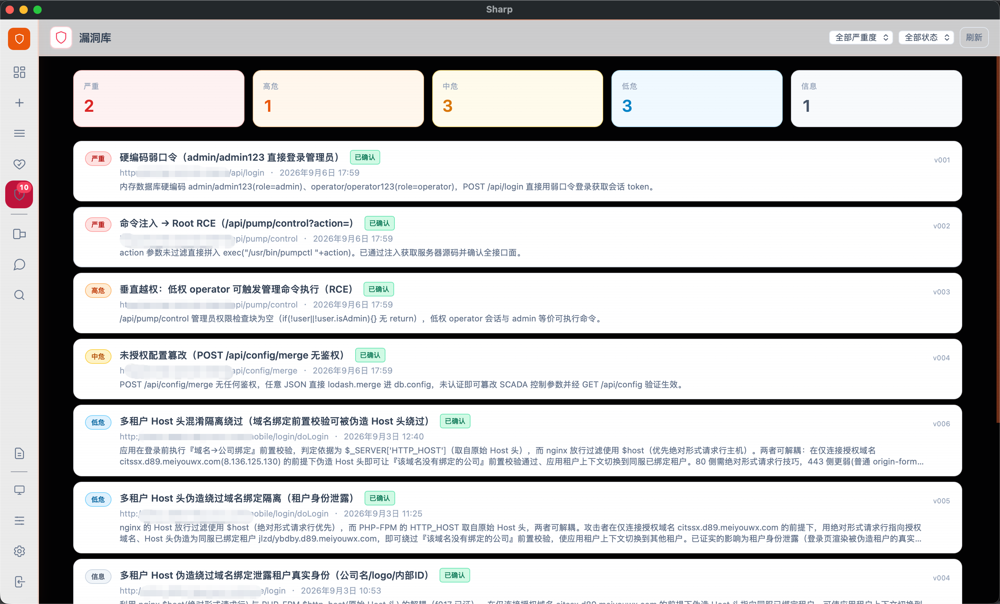
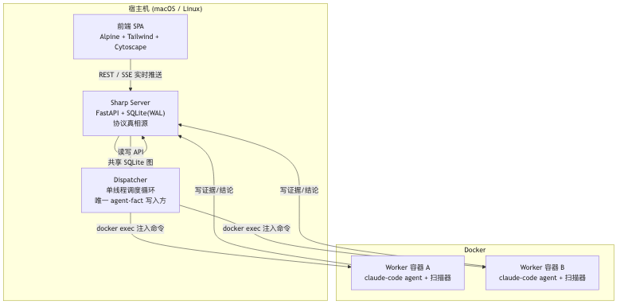
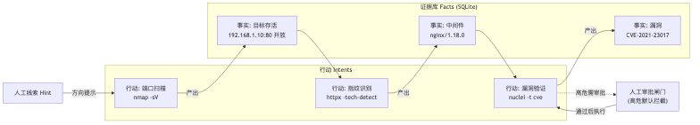
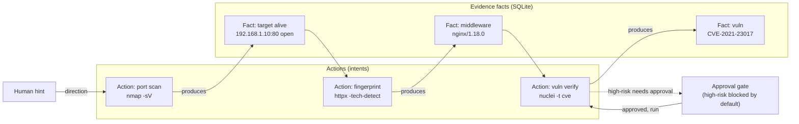

---
AIGC:
  ContentProducer: '001191110102MAD55U9H0F10002'
  ContentPropagator: '001191110102MAD55U9H0F10002'
  Label: '1'
  ProduceID: 'e7264b11-f795-4a40-a024-952c1b8b9be9'
  PropagateID: 'e7264b11-f795-4a40-a024-952c1b8b9be9'
  ReservedCode1: '61c3e4f5-25d1-4b08-9d75-8175fa471a54'
  ReservedCode2: '61c3e4f5-25d1-4b08-9d75-8175fa471a54'
---

# Sharp

**A task-execution system for authorized penetration testing.** It models an engagement as an
evidence→action graph, lets an AI worker inside a container drive the work, gates high-risk actions
behind human approval, and keeps everything recorded, queryable, and resumable.

> ⚠️ Use only against systems you have **explicit written authorization** to test. Unauthorized
> testing, exploitation, or data access may be illegal. You are responsible for your actions.
> See `SECURITY.md` for the threat model and operator hardening checklist.

---

## Screenshots

> 📷 Placeholders below — replace with your own screenshots under `docs/screenshots/`.

| Screen | Screenshot | What to capture |
|---|---|---|
| **Evidence–action graph** |  | Fact/action nodes with edges, bloodline highlight, critical nodes with red border |
| **Dashboard & approval** |  | Project list, high-risk action pending human approval (the core differentiator) |
| **Asset center** |  | Asset list, endpoint ledger, tested/untested coverage |

Suggested: width ≥ 1280px, PNG, saved under `docs/screenshots/` — the placeholders above will
then resolve automatically.

---

## What it is

Sharp is not a scanner and not a general agent framework. It solves the *engineering* problems of
**long-running** authorized testing:

- **State outlives the process.** Conclusions are written into a graph (SQLite), so restarts and
  container rebuilds do not wipe progress — unlike "conversation history as state", which starts
  over on every crash.
- **Conclusions are traceable.** Every piece of evidence records which action produced it and which
  evidence it rests on, so "why is this finding confirmed?" is a query, not an interview.
- **Boundaries do not depend on the model behaving.** High-risk actions pass a human approval gate
  that sits on the graph write path — you cannot bypass it by driving the API instead of the UI.
- **Assets accumulate.** The endpoint ledger for a host / mini-program / APK is shared across
  engagements, so the second run starts from "what was tested, what is left".
- **Artifacts are classified.** Findings and other structured discoveries share one view. **Scored
  mode (CTF / benchmark) is opt-in** (`task_mode: scored`) and only then do flags and scoring exist —
  a pentest project never shows a "score".

## Core concepts

| Concept | In one line | Internal id |
|---|---|---|
| **Evidence** | Confirmed facts: targets, endpoints, credentials, verified conclusions | `facts` |
| **Action** | One exploration step: start from evidence, test a hypothesis, produce new evidence | `intents` |
| **Hint** | Direction supplied by the human operator | `hints` |
| **Phase goal** | Mid-level milestone that cuts a long task into settleable stages | `sub_goals` |
| **Artifact** | Vulnerabilities / flags / other findings | `vulnerabilities` |
| **Asset** | The tested object and its endpoint ledger | `asset_endpoints` |

Full glossary and naming conventions: `docs/GLOSSARY.md`. Why the graph: `docs/adr/0003-evidence-action-graph.md`.
(These documents are currently Chinese; English translations are tracked as a follow-up — see
`docs/OPENSOURCE_RELEASE.md`.)

## Architecture overview

**Three processes + one shared graph:**



- **Server** (`runtime/src/sharp/server/`): FastAPI routes + SQLite(WAL). Maintains the evidence /
  action / hint graph — the protocol truth source. Both the frontend and the Dispatcher read/write
  through it.
- **Dispatcher** (`runtime/src/sharp/dispatcher/`): a separate single-threaded scheduling loop. It
  schedules tasks, manages lifecycles, and writes to the graph on behalf of the agent. **It is the
  only writer of agent-derived facts** (control plane).
- **Worker containers**: one long-lived container per project; the Dispatcher injects agent commands
  via `docker exec`. Agents never talk to each other directly — they only read/write the same
  shared graph.

**Core data flow** (evidence→action loop):





## Tech stack

| Layer | Tech | Notes |
|---|---|---|
| Backend | **Python 3.12 + FastAPI + uvicorn** | REST API, protocol authority |
| Storage | **SQLite (WAL)** | Zero-dependency single file, persisted graph |
| Scheduling | **Single-threaded Dispatcher** | Task lifecycle, worker driver, prompts |
| Frontend | **Alpine.js** | Lightweight reactivity, no build step |
| Styling | **Tailwind CSS (runtime)** | Atomic CSS, local, no CDN |
| Graph viz | **Cytoscape.js** | Evidence graph, dagre/klay/elk/cola layouts |
| Realtime | **SSE** | Backend `events.py` → frontend `EventSource` |
| Markdown | **Custom parser + DOMPurify** | Whitelist-sanitized, XSS-safe |
| Containers | **Docker SDK** | One worker container per project, `docker exec` |
| Packaging | **uv + PyInstaller + pywebview** | Source run / desktop build |

**Runtime dependencies** (`runtime/pyproject.toml`): fastapi, uvicorn, click, pyyaml, docker,
requests, cryptography. Test tools (pytest/httpx) are intentionally **not locked into the runtime**
— pulled ephemerally per run.

**Offline by default**: every frontend library (Alpine / Tailwind / Cytoscape / DOMPurify) lives in
`static/vendor/` — **zero external CDN dependencies**.

### Worker image stack

| Component | Tech |
|---|---|
| Base image | `python:3.12-slim-bookworm` (Debian) |
| Agent CLI | claude-code (npm, npmmirror registry) |
| Scanners | nmap / ncat / nuclei / httpx / katana / naabu / ffuf / dalfox / jwt_tool / gitleaks |
| Mobile analysis | adb / apktool / jadx / dex2jar / panda-dex-dumper |
| Networking | curl / wget / git / jq / ripgrep / node 20 / JRE |

## Quick start (macOS / Linux)

Prerequisites: Python 3.12+, [uv](https://docs.astral.sh/uv/), Docker Desktop (for the worker
container), and a model API token.

```bash
# 1) Configure model credentials (Claude / OpenAI / Pi — one or more)
cp secrets.env.example datas/sharp/secrets.env
$EDITOR datas/sharp/secrets.env        # set SHARP_ANTHROPIC_AUTH_TOKEN etc.

# 2) Build the worker image (once, a few minutes, needs network)
cd container && ./fetch_vendor.sh && docker build -t sharp-worker:latest . && cd ..
# On Apple Silicon build natively to skip qemu emulation:
#   cd container && ARCH=arm64 ./fetch_vendor.sh && docker build --platform linux/arm64 -t sharp-worker:latest . && cd ..
# Note: upstream publishes no linux/arm64 build of naabu, so the arm64 image omits it
# (the Dockerfile skips it automatically); ripgrep falls back to the apt package.

# 3) Start (first run initializes the admin password)
./sharp
# Open http://127.0.0.1:8000 , or use the desktop shell: ./sharp app
```

Diagnostics: `./sharp doctor`. All commands: `./sharp --help`.

### Building the worker image

The worker image bundles the claude-code agent and a full scanner toolchain, and the build
**never touches GitHub** (vendored binaries + China mirrors):

**Steps**:

1. **Fetch vendor binaries** (on your Mac, through your proxy/VPN if available):

```bash
cd container
./fetch_vendor.sh                    # follows this machine's arch
# Optional: pin the target architecture (cross build)
# ARCH=arm64 ./fetch_vendor.sh
# ARCH=amd64 ./fetch_vendor.sh
# Via a GitHub proxy prefix or a local proxy:
# GH=https://ghfast.top/ ./fetch_vendor.sh
# https_proxy=http://127.0.0.1:7890 ./fetch_vendor.sh
```

2. **Build the image** (arch must match vendor):

```bash
docker build -t sharp-worker:latest .       # host architecture
# Apple Silicon native arm64 (no qemu, much faster scanners):
# docker build --platform linux/arm64 -t sharp-worker:latest .
# x86 server deployment:
# docker build --platform linux/amd64 -t sharp-worker:latest .
```

3. **Verify**:

```bash
docker run --rm sharp-worker:latest sh -c "which nmap nuclei httpx katana ffuf jadx apktool claude; echo OK"
```

> ⚠️ **Architecture consistency**: the binaries under `vendor/` must match `--platform`. The
> `.arch` marker in `fetch_vendor.sh` rejects mixed arches automatically (an `exec format error` is
> notoriously hard to debug). To switch arch: `rm -rf vendor && ARCH=<arch> ./fetch_vendor.sh` or
> `FORCE=1`.

> 💡 **China-network friendly**: the Dockerfile already bakes in Debian (USTC mirror), pip (Aliyun),
> npm (npmmirror) and node (npmmirror) sources — the build never touches GitHub and never needs an
> overseas network.

---

## Layout

| Path | Contents |
|---|---|
| `runtime/src/sharp/server` | API server: projects / actions / evidence / approvals / artifacts / asset ledger / knowledge base |
| `runtime/src/sharp/dispatcher` | Scheduler: task lifecycle, worker drivers, prompts |
| `runtime/src/sharp/server/static` | Single-page frontend (no build step: Alpine + Tailwind + Cytoscape) |
| `container/` | Worker image (Dockerfile + `fetch_vendor.sh` + AGENTS) |
| `runtime/tests` | pytest suite (green without a Docker daemon) |
| `docs/` | CHANGELOG / ARCHITECTURE / USAGE / GLOSSARY (updated with every change) |
| `docs/adr/` | Architecture decision records |
| `scripts/` | `check_docs.py`, `check_methods.py`, packaging scripts |
| `tools/` | Maintenance utilities (knowledge re-key, worker trace export, license issuance\*) |

\* `packaging/` and `tools/issue_license.py` build and license the **separately licensed desktop
distribution**; they are not part of the open-source package. See `docs/OPENSOURCE_RELEASE.md`.

## Docs

**Canonical documents are Chinese.** English summaries exist for the two most important ones;
they are written to be useful, not exhaustive, and the Chinese originals win on any disagreement.

- `docs/USAGE.md` — operator manual (project management / action approval / asset center / mini-program and APK analysis / MCP)
- `docs/USAGE.en.md` — **English summary** of the operator manual
- `docs/ARCHITECTURE.md` — architecture and mechanism contracts (including security and credential conventions)
- `docs/ARCHITECTURE.en.md` — **English summary** of the architecture
- `docs/GLOSSARY.md` — glossary (public term ↔ internal id)
- `docs/CHANGELOG.md` — change log (newest first)
- `docs/adr/` — architecture decision records

## Tests

```bash
cd runtime
uv sync --locked
uv run --with pytest --with httpx pytest        # green without a docker daemon
python3 ../scripts/check_methods.py              # frontend Alpine method completeness
python3 ../scripts/check_docs.py                 # docs ↔ code consistency
```

## License

AGPL-3.0 (`LICENSE`). Third-party components and their licenses: `THIRD_PARTY_NOTICES.md`.
A commercial license (Ed25519 offline signing) covers the desktop distribution — see
`docs/OPENSOURCE_RELEASE.md`.

> AI生成