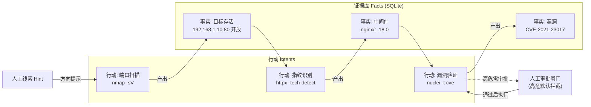

---
AIGC:
  ContentProducer: '001191110102MAD55U9H0F10002'
  ContentPropagator: '001191110102MAD55U9H0F10002'
  Label: '1'
  ProduceID: '714d1303-0673-485c-bbea-e09194d0b13b'
  PropagateID: '714d1303-0673-485c-bbea-e09194d0b13b'
  ReservedCode1: '9db64d6d-9d6f-4755-af4a-674e7bc0a424'
  ReservedCode2: '9db64d6d-9d6f-4755-af4a-674e7bc0a424'
---

# Sharp

**面向授权渗透测试的任务执行系统**：把一次授权测试建模成一张「证据 → 行动」图，由容器内 AI worker 自主推进，人工闸门卡住高危动作，全程留痕、可查询、可续跑。

> ⚠️ 仅限用于**已获明确书面授权**的系统。未经授权的测试、利用或数据访问可能违反法律，后果自负。

---

## 截图预览

> 📷 以下为预留占位，截图后替换为 `docs/screenshots/` 下的图片。

| 界面 | 截图 | 拍摄要点 |
|---|---|---|
| **证据—行动图** |  | 证据（fact）节点与行动（intent）节点的连线、血缘关系、高危节点红色边框 |
| **任务看板与审批** |  | 项目列表、行动审批闸门弹窗（高危待批）、任务进度 |
| **资产中心** |  | 资产清单、接口账本、已测/待测覆盖视图 |

**截图清单（拍摄要点）**：

1. `graph.png` — 打开某项目 → 证据—行动图视图。展示：节点 + 连线 + 血缘高亮，最好有一个**高危（红色边框）漏洞节点**。
2. `dashboard.png` — 项目看板。展示：项目列表 + 任务状态 + 一个**待审批的高危行动**弹窗（这是 Sharp 的核心差异化：人工闸门）。
3. `assets.png` — 资产中心。展示：资产列表 + 接口账本 + 已测/待测覆盖情况。

> 建议截图尺寸：宽 ≥ 1280px，PNG 格式，放到 `docs/screenshots/` 后 README 中的占位链接即自动生效。

---

## 它是什么

Sharp 不是扫描器，也不是通用 agent 框架。它解决的是**长周期授权测试**的工程问题：

- **状态比进程活得久**：结论存进图（SQLite），进程重启、容器重建都不失忆——不像"把对话历史当状态"那样一崩就从头再来。
- **结论可追溯**：每条证据都记录它由哪个行动、依据哪几条证据得出；"这个漏洞凭什么确认"是可查询的。
- **边界不靠模型自觉**：高危行动在执行前经过人工审批闸门（默认拦截），闸门卡在图写入路径上——绕过界面也绕不过它。
- **资产会积累**：同一 host / 小程序 / APK 的接口账本跨任务复用，第二次测试直接看到"测过什么、还差什么"。
- **产物可分类**：漏洞与其他结构化发现（配置缺陷、可疑入口）共用一套产物视图；**评分类任务（CTF / 评测）是可选的 `scored` 模式**，只有它才启用旗帜与记分——渗透项目里不会出现"分数"这种与授权测试无关的概念。

## 核心概念

| 概念 | 一句话 | 内部标识符 |
| --- | --- | --- |
| **证据** | 已确认的事实：目标、接口、凭据、验证过的结论 | `facts` |
| **行动** | 一步探索：从若干证据出发，验证一个猜想并产出新证据 | `intents` |
| **线索** | 人工给出的方向提示 | `hints` |
| **阶段** | 中层里程碑，把长任务切成可结算的小段 | `sub_goals` |
| **产物** | 漏洞 / 旗帜 / 其他发现 | `vulnerabilities` |
| **资产** | 被测对象与它的接口账本 | `asset_endpoints` |

完整术语表与命名约定见 `docs/GLOSSARY.md`；为什么这样建模见 `docs/adr/0003-evidence-action-graph.md`。

## 架构总览

**三进程协作 + 一张共享图**：


- **Server**（`runtime/src/sharp/server/`）：FastAPI 路由 + SQLite(WAL)。维护证据 / 行动 / 线索图，是协议真相源。前端和 Dispatcher 都通过它读写。
- **Dispatcher**（`runtime/src/sharp/dispatcher/`）：独立进程，单线程调度循环。调度任务、管理生命周期、代 agent 调用 Server API 写图。**是 agent 派生 fact 的唯一写入方**（控制面）。
- **Worker 容器**：每个项目一个长驻容器，Dispatcher 通过 `docker exec` 把 agent 命令注入执行。Agent 之间不直接通信，只读写同一张共享图。

**核心数据流**（证据 → 行动闭环）：




## 技术栈

| 层 | 技术 | 说明 |
|---|---|---|
| 后端框架 | **Python 3.12 + FastAPI + uvicorn** | REST API，协议真相源 |
| 存储 | **SQLite (WAL)** | 零依赖单文件存储，证据图持久化，`db.py` 维护 |
| 调度 | **单线程 Dispatcher** | 任务生命周期、worker 驱动、提示词 |
| 前端框架 | **Alpine.js** | 轻量响应式，无构建步骤 |
| 前端样式 | **Tailwind CSS（运行时版）** | 原子化 CSS，本地化引入无 CDN 依赖 |
| 图可视化 | **Cytoscape.js** | 证据—行动图渲染，dagre/klay/elk/cola 布局 |
| 实时通信 | **SSE**（Server-Sent Events） | 后端 `events.py` → 前端 `EventSource` |
| Markdown 渲染 | **自研解析器 + DOMPurify** | 白名单过滤防 XSS |
| 容器 | **Docker SDK** | 每项目一个 worker 容器，`docker exec` 执行 agent |
| 打包 | **uv + PyInstaller + pywebview** | 源码运行 / 桌面发行版 |
| 字体 | ark-pixel-12px woff2 | 中文像素字体 |

**运行时依赖**（`runtime/pyproject.toml`）：fastapi、uvicorn、click、pyyaml、docker、requests、cryptography。测试工具（pytest / httpx）刻意**不锁入运行时**，按需临时拉取。

**离线可用**：前端所有第三方库（Alpine / Tailwind / Cytoscape / DOMPurify）本地化在 `static/vendor/`，**零外部 CDN 依赖**。

### Worker 镜像技术栈

| 组件 | 技术 |
|---|---|
| 基础镜像 | `python:3.12-slim-bookworm`（Debian） |
| Agent CLI | claude-code（npm，npmmirror 源） |
| 扫描器 | nmap / ncat / nuclei / httpx / katana / naabu / ffuf / dalfox / jwt_tool / gitleaks |
| 移动端分析 | adb / apktool / jadx / dex2jar / panda-dex-dumper |
| 网络工具 | curl / wget / git / jq / ripgrep / node 20 / JRE |

## 快速开始（macOS / Linux）

前置：Python 3.12+、[uv](https://docs.astral.sh/uv/)、Docker Desktop（worker 容器需要）、一个模型 API token。

```bash
# 1) 配置模型凭据（Claude / OpenAI / Pi 三选一或都配）
cp secrets.env.example datas/sharp/secrets.env
$EDITOR datas/sharp/secrets.env        # 填 SHARP_ANTHROPIC_AUTH_TOKEN 等

# 2) 构建 worker 镜像（一次，几分钟；需网络）
cd container && ./fetch_vendor.sh && docker build -t sharp-worker:latest . && cd ..
# Apple Silicon 建议构建原生 arm64（省掉 qemu 模拟，容器内跑扫描器快数倍）：
#   cd container && ARCH=arm64 ./fetch_vendor.sh && docker build --platform linux/arm64 -t sharp-worker:latest . && cd ..
# 注：naabu 上游未提供 linux/arm64 构建，arm64 镜像中不含它（Dockerfile 会自动跳过）；ripgrep 走 apt 安装

# 3) 启动（首次会初始化管理员密码）
./sharp
# 浏览器打开 http://127.0.0.1:8000 ，或用桌面壳 ./sharp app
```

诊断：`./sharp doctor`；命令一览：`./sharp --help`。

### Worker 镜像环境搭建

Worker 容器内置 claude-code agent 和全套扫描工具，**构建时零 GitHub 访问**（vendor 预下载 + 国内镜像）：

**步骤**：

1. **拉取 vendor 二进制**（在你的 Mac 上，走代理/VPN 更快）：

```bash
cd container
./fetch_vendor.sh              # 跟随本机架构
# 可选：指定目标架构（交叉构建）
# ARCH=arm64 ./fetch_vendor.sh
# ARCH=amd64 ./fetch_vendor.sh
# 走 GitHub 代理前缀或本地代理：
# GH=https://ghfast.top/ ./fetch_vendor.sh
# https_proxy=http://127.0.0.1:7890 ./fetch_vendor.sh
```

2. **构建镜像**（架构须与 vendor 一致）：

```bash
docker build -t sharp-worker:latest .        # 本机架构
# Apple Silicon 原生 arm64（省掉 qemu，扫描器快数倍）：
# docker build --platform linux/arm64 -t sharp-worker:latest .
# x86 服务器部署：
# docker build --platform linux/amd64 -t sharp-worker:latest .
```

3. **验证**：

```bash
docker run --rm sharp-worker:latest sh -c "which nmap nuclei httpx katana ffuf jadx apktool claude; echo OK"
```

> ⚠️ **架构一致性**：`vendor/` 里的二进制架构必须与 `--platform` 一致。`fetch_vendor.sh` 的 `.arch` 标记会自动拦截混用（`exec format error` 极难排查）；换架构重下请 `rm -rf vendor && ARCH=<arch> ./fetch_vendor.sh` 或 `FORCE=1`。

> 💡 **国内加速**：Dockerfile 已内置 Debian 中科大镜像、pip 阿里云镜像、npm/npmmirror、node npmmirror 源，构建过程不访问 GitHub、不依赖国外源。

---

## 目录速览

| 路径 | 内容 |
|---|---|
| `runtime/src/sharp/server` | API 服务器：项目/行动/证据/审批/产物/资产账本/知识库 |
| `runtime/src/sharp/dispatcher` | 调度器：任务生命周期、worker 驱动、提示词 |
| `runtime/src/sharp/server/static` | 前端单页应用（无构建步骤：Alpine + Tailwind + Cytoscape） |
| `container/` | worker 镜像（Dockerfile + fetch_vendor.sh + AGENTS） |
| `runtime/tests` | pytest 测试套件（无 docker 依赖全绿） |
| `docs/` | CHANGELOG / ARCHITECTURE / USAGE / GLOSSARY（每次变更同步更新） |
| `docs/adr/` | 架构决策记录（为什么这么选、放弃了什么） |
| `docs/OPENSOURCE_RELEASE.md` | **开源版打包边界**：哪些进包、哪些绝不能进、哪些要脱敏 |
| `packaging/`\* | 打包：macOS 组装、Windows build.bat、PyInstaller spec |
| `tools/issue_license.py`\* | 打包二进制的试用 license 签发工具（源码运行不需要） |
| `tools/backfill_flags.py` | 把历史任务里"只写在文字里"的旗帜成绩回填为结构化产物（默认 dry-run、幂等） |

\* 属于**另一个（单独授权的）桌面发行版**的构建工具链，不在开源包里；开源版边界与理由见
`docs/OPENSOURCE_RELEASE.md`。开源包用 `bash scripts/package_opensource.sh` 生成（内置泄漏自检：
发现密钥/私钥/运行库/真实报告即**打包失败**）。

## 文档

- `docs/USAGE.md` — 使用手册（项目管理 / 行动审批 / 资产中心 / 小程序与 APK 分析 / MCP）
- `docs/ARCHITECTURE.md` — 架构真相与机制约定（含安全与凭据约定）
- `docs/ARCHITECTURE.en.md` / `docs/USAGE.en.md` — 英文摘要版（中文为唯一权威，两者冲突以中文为准）
- `docs/GLOSSARY.md` — 术语表（对外术语 ↔ 内部标识符）
- `docs/CHANGELOG.md` — 变更流水（最新置顶）
- `docs/OPENSOURCE_RELEASE.md` — 开源版打包边界与发布流程
- `docs/adr/` — 架构决策记录
- `SECURITY.md` — 威胁模型、残留风险、运维加固清单、漏洞报告渠道（**部署前请读**）
- `CONTRIBUTING.md` — 开发与验证流程（三道检查 + 房规）
- `THIRD_PARTY_NOTICES.md` — 第三方组件与许可
- `README.en.md` — English README

## 测试

```bash
cd runtime
uv sync --locked
uv run --with pytest --with httpx pytest        # 无 docker daemon 也可全绿
python3 ../scripts/check_methods.py              # 前端 Alpine 方法完整性
```

## 开源与许可

- 本开源包按 **AGPL-3.0** 发布，详见 `LICENSE`。
- 另有**商业授权**（Ed25519 离线授权）用于桌面发行版，见 `docs/OPENSOURCE_RELEASE.md`。
- 第三方组件许可见 `THIRD_PARTY_NOTICES.md`。

> AI生成